# 在windows上通过docker配置环境并利用vscode调试代码（手把手版）

-- 由严奕凡编写，就读于重庆大学.

**系统情况：** windows操作系统,版本win11

**个人情况：** from 0 to 1 不想用虚拟机,不想用gitpod 

**参考资料：** https://oceanbase.github.io/miniob 、小伙伴们的讨论、亲身经历

**配置思路：**
1、使用docker提供linux编译环境
2、使用vscode进行代码编辑
3、使用vscode的docker插件，在vscode终端调试

**个人理解1:** docker对我来说就是在windows系统上提供一个虚拟的linux环境，它只在build和调试时起到作用

**个人理解2:** vscode用来编辑代码

**个人理解3:** vscode里面docker插件的attach功能可以在vscode的终端实现一个linux的虚拟环境，使得miniob的build.sh能在其中通过bash指令运行

# 实操：

## 1、下载docker

[Get Started | Docker](https://www.docker.com/get-started/)


## 2、获取oceanbase/miniob的docker环境

方法是在任意位置启动 终端(cmd或者powershell)

运行以下代码

```bash
docker run --privileged -d --name=miniobtest oceanbase/miniob
```

其中 --name=miniobtest  这个“miniobtest”是自己容器的名字 可以自己改 
这个代码大概理解成从远程oceanbase/miniob拉取适合miniob的配置好的环境

这一步之后先把docker放一放，后面需要将本地文件与docker进行一个连接，先不放代码以免产生误解

## 3、在vscode中使用git 对官网miniob进行clone ，在本地创建一个代码仓库

PS：这一步部分小伙伴可能会遇到网络问题，提示您clone的时候连接到github失败，有两种解决办法，其一是解决访问github的问题，其二是直接从github上下载源代码下来,另外还可以用ssh的方式clone代码，速度比https快很多(本文档暂未给出ssh使用办法，有兴趣的小伙伴可以进行补充)


### 1）准备工作（有vscode和git，并且配置好环境变量的小伙伴可以看下一步）：

下载vscode [Visual Studio Code - Code Editing. Redefined](https://code.visualstudio.com/)

下载git [Git (git-scm.com)](https://git-scm.com/)

配置vscode设置 ,下载所需插件：例如docker
_____


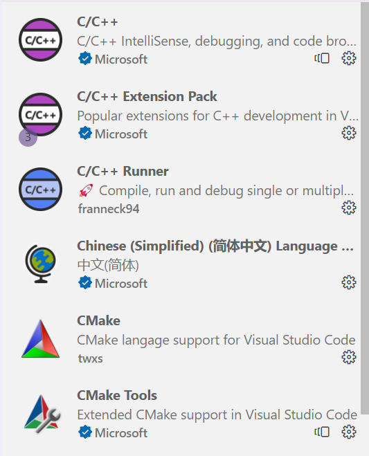


配置环境变量（这是为了让git能在vscode终端中使用）：

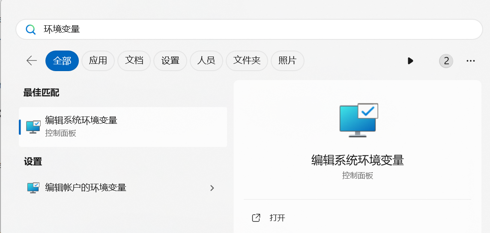

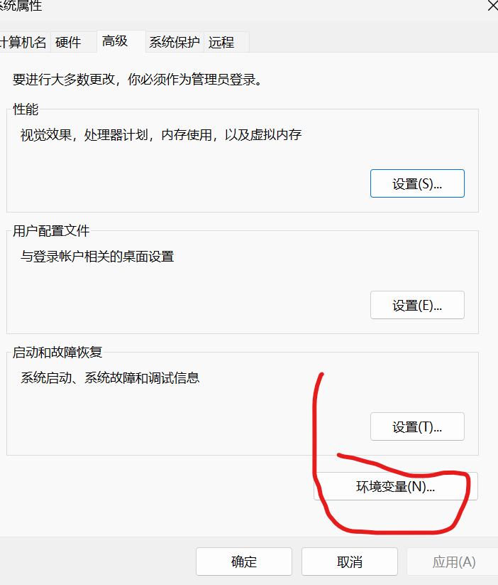

验证以下路径是否存在（如果没有，请添加文件路径）

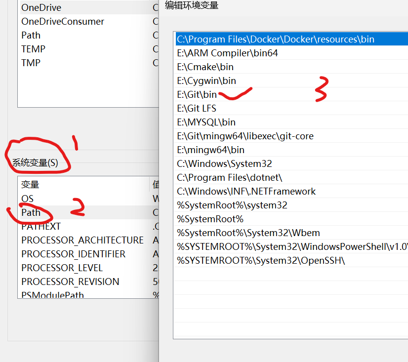

### 2）进入vscode clone 代码


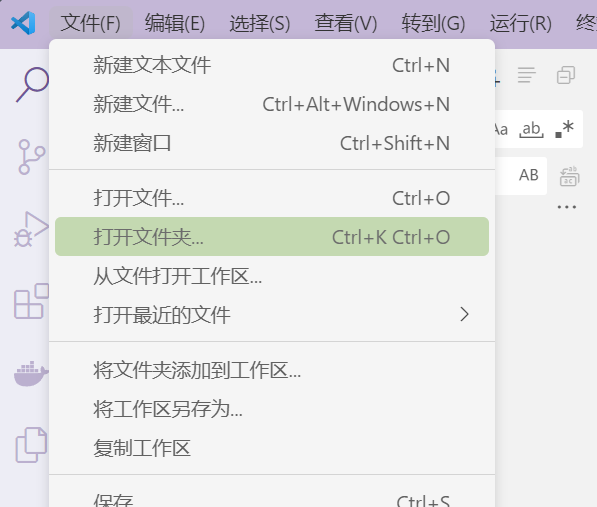

文件-打开文件夹，选取一个用于保存代码的文件夹

然后ctrl+shift+~ (快速新建一个终端)
(PS：Mac 系统 Command + J)

在终端里输入

~~~bash
git clone https://github.com/oceanbase/miniob.git
~~~

如果git配置正确并且能成功连接到github

您可以得到


然后您可以进入得到的代码文件查看分支信息：例如


~~~bash
ls       --查看当前目录
cd ‘文件名’      --进入
~~~


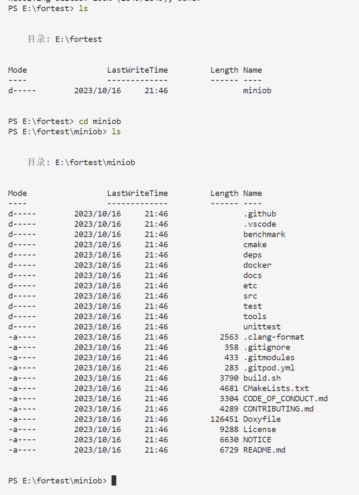

您可以输入  （要先进入clone得到的代码文件里面，才能读取到.git文件）

~~~bash
git branch -a 
~~~

查看所有分支

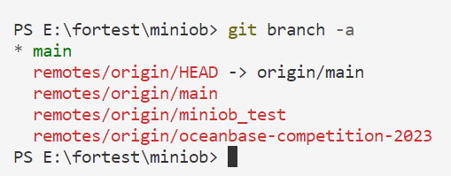


## 4、将获取到的文件与docker容器 映射连接

### 创建一个container（映射方式）

恭喜！您已经获取到代码文件，并且实现了大部分配置！

接下来我们进入clone得到的文件夹的**上一层目录**，在那打开终端（这是方便后续代码的实现）

您也可以用cd 指令进入得到的文件夹的**上一层目录**

像这样

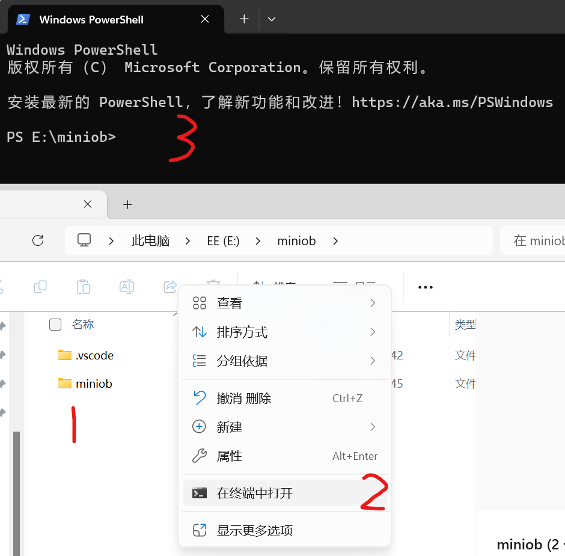

然后输入

~~~bash
docker run -d --name fortest --privileged -v $PWD/miniob:/root/miniob oceanbase/miniob
~~~

分析如下：

> - 您提供的命令`docker run`用于运行具有特定选项和配置的 Docker 容器，但它还指定要运行的映像。让我们分解一下命令：
>
>   - `docker run`：这是启动新 Docker 容器的基本命令。
>   - `-d`：此选项以分离模式运行容器，这意味着它在后台运行，允许您继续使用终端。
>   - `--name fortest`：此选项指定容器的名称为“fortest”。
>   - `--privileged`：这是一个与安全相关的选项，可授予容器额外的权限，从而有效地赋予其对主机系统的更高访问权限。使用时要小心，`--privileged`因为它可能会带来安全风险。
>   - `-v $PWD/miniob:/root/miniob`：此选项用于创建卷安装。它将主机系统上的目录或文件映射到容器内的目录。在本例中，它将主机系统上`miniob`当前工作目录 ( ) 中的目录映射到容器内的目录。这是向容器提供数据或配置的常见方法。`$PWD``/root/miniob`
>   - `oceanbase/miniob`：指定要运行的 Docker 映像。镜像“oceanbase/miniob”用于创建容器。如果您的系统上尚未提供该映像，Docker 将尝试从 Docker Hub 中提取该映像。
>
>   因此，总体命令是以分离模式运行名为“fortest”的 Docker 容器，授予其提升的权限，将目录`miniob`从主机系统安装到`/root/miniob`容器内的目录，并使用“oceanbase/miniob”映像作为容器。此命令对于运行基于具有特定配置的“oceanbase/miniob”映像的容器非常有用。


得到的结果如图


此时您应该可以在docker里面查看到container

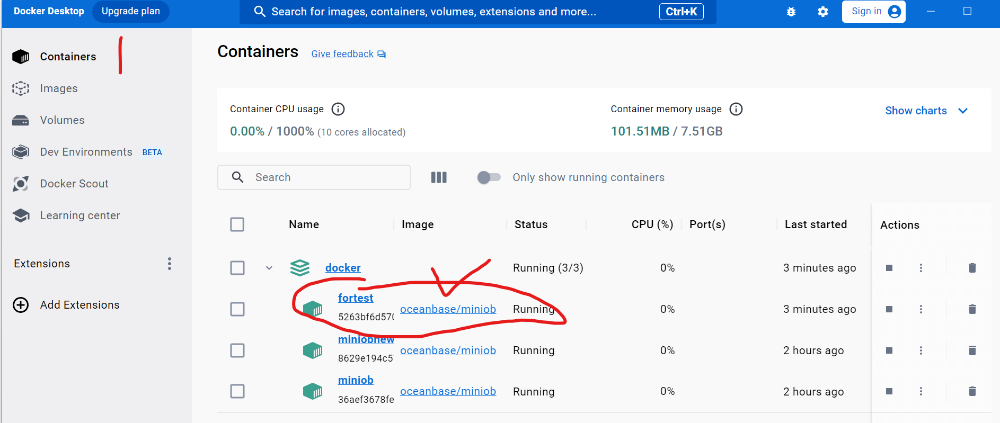


## 5、在vscode中启动docker

1）先打开docker软件（每次重启电脑后都需要做）

2）打开vscode，在左侧边栏找到下载好的docker插件
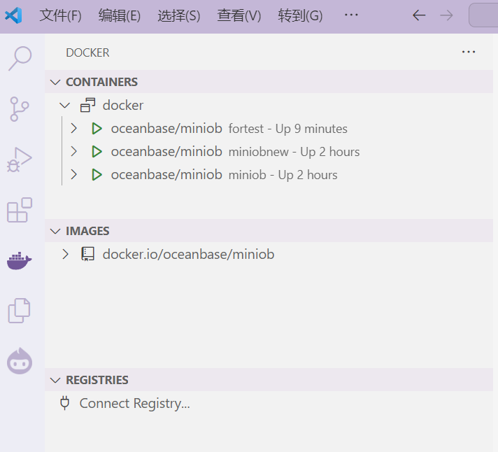

然后选中您刚才用以下代码生成的容器，如果是初次生成，您可能只会显示一个容器

~~~bash
docker run -d --name fortest --privileged -v $PWD/miniob:/root/miniob oceanbase/miniob
~~~

右键选中容器然后attach shell


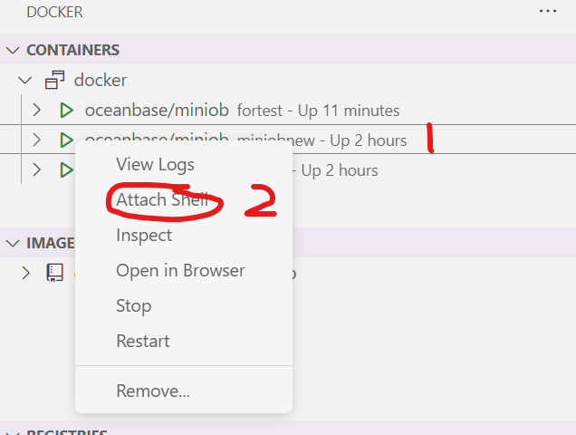


然后在打开的终端中就可以编译miniob了！

（注意，一开始是不会有build 和build_debug文件的,这两个是通过运行bash.sh生成的）

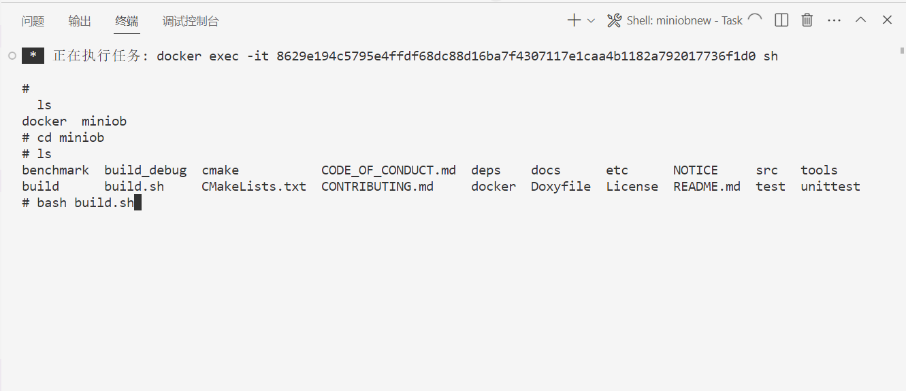

综合运用以下代码运行build.sh文件

~~~bash
ls
cd miniob
bash build.sh
~~~

解释如下

> 您提供的命令是类 Unix 操作系统终端（例如 Linux）中使用的典型命令。让我分解一下命令：
>
> 1. `ls`：该命令是“list”的缩写。它用于列出当前目录中的文件和目录。运行`ls`将显示当前工作目录中的文件和文件夹列表。
> 2. `cd miniob`：此命令将当前工作目录更改为名为“miniob”的子目录。您将导航到“miniob”目录。
> 3. `bash build.sh`：此命令正在运行名为“build.sh”的 Bash 脚本。该脚本可能用于构建或编译某些软件、设置开发环境或执行与“miniob”项目或应用程序相关的其他任务。运行此脚本将执行其中定义的命令。
>
> 假设“build.sh”是“miniob”项目的构建脚本，则运行这些命令是构建或设置项目的常见顺序。该`ls`命令用于检查当前目录的内容，`cd`用于更改到“miniob”目录，并`bash build.sh`用于执行构建脚本。


编译通过后你可以在目录看到 build 或者build_debug 文件 然后可以进去调试

示例代码：

~~~bash
cd build_debug
./bin/observer -f ../etc/observer.ini -P cli
#这会以直接执行命令的方式启动服务端程序，可以直接输入命令，不需要客户端。所有的请求都会以单线程的方式运行，配置项中的线程数不再有实际意义。
~~~


示例图（ps：drop table功能一开始没有实习，需要您自己去尝试实现）

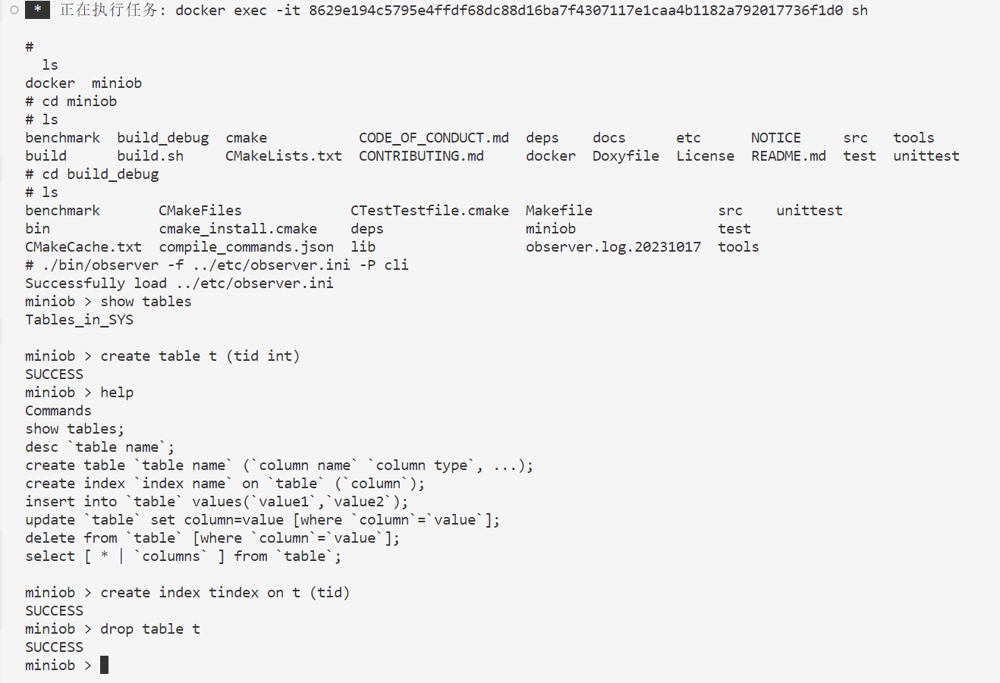


您也可以启动服务端后再启用客户端，也可以实现类似效果
在vscode中操作为 再次attach shell新建一个终端
参考文档：https://oceanbase.github.io/miniob/how_to_run.html

**以监听TCP端口的方式启动服务端程序**

```bash
./bin/observer -f ../etc/observer.ini -p 6789
```

这会以监听6789端口的方式启动服务端程序。 启动客户端程序：

```bash
./bin/obclient -p 6789
```

这会连接到服务端的6789端口。


编辑日期  2023-10-17      